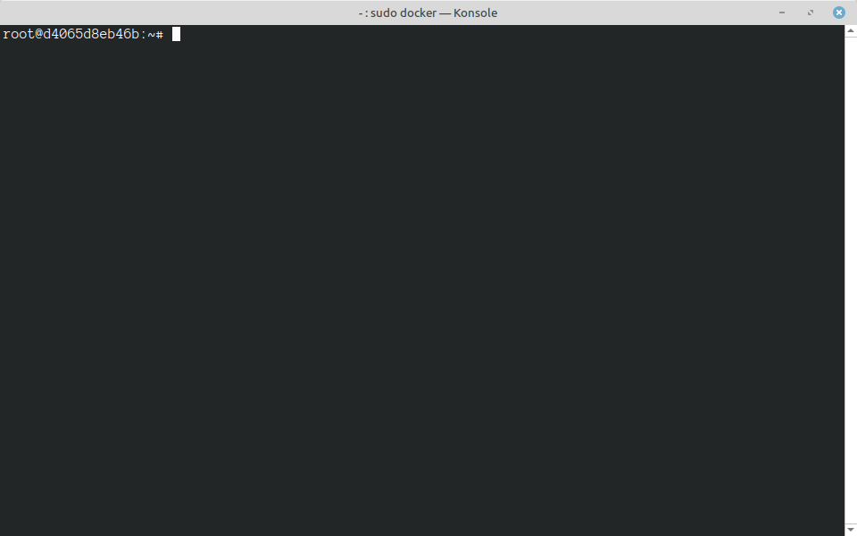

# Getting Started

This tutorial assumes that you are comfortable using a Unix terminal, that you
have some experience programming in C++, and that you have a basic understanding
of concurrency topics (threads, locks, compare-and-swap, data races).

In this step of the Remus tutorial, you'll learn about the required tools and
software for building Remus programs, you'll download the Remus source code, and
you'll learn about the files and folders in the Remus repository.

## Software Configuration

Remus is a C++ library designed for the Linux operating system.  Since this
tutorial is focused on building and running Remus applications on [NSF
CloudLab](https://www.cloudlab.us/), the easiest way to get started is to use
[Docker](https://www.docker.com/).  This step of the tutorial will help you get
set up, via Docker, without needing any other software on your development
machine.

Below, you will find a `Dockerfile` that defines a container image that matches
the configuration of CloudLab "r320" nodes.  It includes the following software:

- Operating System: Ubuntu Linux 24.04
- C++20-Compatible Compiler: Clang++18
- Standard Build Tools and Libraries: `make`, `cmake`, `git`, `libnuma`,
  `gdb`, `python3`
- RDMA Libraries: `librdmacm`, `libibverbs`
- Other Tools: `screen`

To get started, navigate to the folder where you'd like to work, and paste the
following text as a file named `Dockerfile`.  (Note: the [Remus GitHub
Repository](https://github.com/sss-lehigh/remus-tutorial-2025) also contains a
copy of this `Dockerfile`.)

```docker
FROM ubuntu:24.04

# Get latest software (standard ubuntu package manager)
RUN apt-get update -y
RUN apt-get upgrade -y
RUN DEBIAN_FRONTEND=noninteractive apt-get install -y build-essential python3 cmake git man curl libnuma-dev librdmacm-dev libibverbs-dev screen lsb-release software-properties-common openssh-client

# Get LLVM 18
RUN curl -O https://apt.llvm.org/llvm.sh
RUN chmod +x llvm.sh
RUN ./llvm.sh 18
RUN rm ./llvm.sh

# Start in the `/root` folder
WORKDIR "/root"
```

To make a container image from this Dockerfile, go to the folder where this Dockerfile
exists, and type the following (don't forget the trailing `.`):

`docker buildx build --platform=linux/amd64 -t remus .`

:::tip
On Mac and Linux, you might need to prefix the command with `sudo`
:::

Finally, launch an instance of the container.  When you launch an instance,
you'll want to map a part of your local filesystem into the container. A good
choice is the location where you created the `Dockerfile`.  The following
command assumes you put the `Dockerfile` in `/home/sss/remus_tutorial`.  If you
are working in another location, be sure to change that part of the command.

```bash
docker run --privileged --rm -v /home/sss/remus_tutorial/:/root -it remus
```

:::tip
On Mac and Linux, you might need to prefix the command with `sudo`
:::

When you enter the above command, you should see something like the following:



This indicates that you've successfully created a container instance.  In the
container instance, you're logged in as root, in the `/root` folder, and if you
type `ls`, you should see that your folder has been mapped into the container
correctly.

To close your container, type `exit` or press `ctrl-d`.

## Getting The Code

If you are not in the `remus` container, launch it with the command you created
in the previous step.

:::tip
You might want to create a script for that command, so it's easier to launch
containers.
:::

From inside the container, in the `/root` folder, check out the remus
repository.  Note that by checking out your repository from *inside* of the
Docker instance, you are guaranteed that line endings will be correct regardless
of whether your development machine uses Linux, MacOS, or Windows.

```bash
git clone https://github.com/sss-lehigh/remus-tutorial-2025.git
```

:::tip
If you are working on a private research project, you will probably want to
**fork** our repository, set up permissions on your fork, and set up ssh keys
inside of your Docker instance.
:::

## A Quick Tour

The folder you just checked out should have the following files and folders
in it:

If you type `ls` from the `remus` subfolder, you should see the following files
and folders:

```text
.
├── .gitignore
├── cl.config
├── cl.experiment
├── cl.sh
├── CMakeLists.txt
├── Dockerfile
├── Makefile
├── README.md
├── benchmark/
├── cmake/
├── rdma/
```

Here's some more information about these files and folders:

- `cl.sh` is a script for interacting with CloudLab
- `cl.config` is a template for providing configuration information to `cl.sh`
- `cl.experiment` is a template for providing information to `cl.sh` about how
  to run experiments.
- `CMakeLists.txt` is used by `cmake` to configure and build the code.  You
  won't need to invoke this directly, it is handled through the `Makefile`.
- `Dockerfile` should match the `Dockerfile` you created above
- `Makefile` provides `make clean` and `make` commands for building
- `benchmark/` has a few example programs
- `cmake/` has some configuration scripts so that `cmake` can find the RDMA
  libraries.
- `rdma/` has all of the Remus code, and also some small test programs

In most cases, you'll only write code in the `benchmark/` subfolder.  It has its
own `CMakeLists.txt` file, where you can provide the names of new programs that
you want to build.

When you're ready to test your code, you'll need to copy `cl.config` and
`cl.experiment`.  We recommend creating a `local/` subfolder (which `.gitignore`
prevents from being committed to the repository) for your copies of these files.
